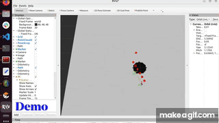
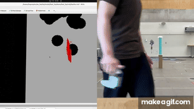

# Perception-Informed Autonomous Navigation for a Monopedal Hopping Robot 
(Instructions are for simulation)

This project simulates **Hopcopter** — a Crazyflie-based monopedal hopping robot — in Gazebo Harmonic. A ROS2 pipeline integrates LiDAR point-cloud processing, OMPL RRT* global path planning, and a multi-criteria local planner that scores and refines candidate landing zones in real time, enabling fully autonomous obstacle-aware navigation. An optional natural-language goal interface (powered by Claude) lets users command the robot in plain English.

## Demo

**Simulation** — [Local planner explanation (YouTube)](https://youtu.be/Yvn6zSlEApQ)



**Hardware** — [Full hardware demo (YouTube)](https://youtu.be/_PuOxqvgZJw)



## Authors

**Zwe Min Htet Aung** — zweminhtetaung@gmail.com

---

## Architecture Overview

```
┌─────────────┐       ┌──────────────────────┐       ┌────────────┐
│ Elevation   │──────▶│  ballistic_planner   │──────▶│  hopcopter │
│ Map (2.5D)  │       │  (A* Global Planner)  │       │ (Control)  │
└─────────────┘       └──────────────────────┘       └────────────┘
                             ▲
                             │
                      ┌──────┴───────┐
                      │  /goal_pose  │
                      │              │
                      ├──────────────┤
                      │ Option A:    │
                      │  ros2 topic  │
                      │  pub --once  │
                      ├──────────────┤
                      │ Option B:    │
                      │  NLP Goal    │
                      │  Interface   │
                      └──────────────┘
```

**Pipeline:**
1. **ballistic_planner** — Reads the 2.5D elevation map, listens for `/goal_pose`, and runs a hopping-aware A* search to compute a global path of physically feasible parabolic hops. Publishes a set of waypoints (Marker id=400).
2. **hopcopter** — Controls the hopping robot's attitude to follow the waypoints.

---

## Prerequisites

- Ubuntu 22.04
- ROS2 Humble
- Gazebo Harmonic
- System packages:
  ```bash
  sudo apt-get install libboost-program-options-dev libusb-1.0-0-dev python3-colcon-common-extensions
  sudo apt-get install ros-humble-motion-capture-tracking ros-humble-tf-transformations
  sudo apt-get install ros-humble-ros-gzharmonic
  ```
- OMPL (Open Motion Planning Library)
- PCL (Point Cloud Library): `sudo apt-get install libpcl-all-dev`
- Python packages: `pip3 install cflib scipy`

---

## Installation

```bash
# Clone the repository
git clone <repo-url> ~/CrazySim
cd ~/CrazySim

# Build the ROS2 workspace
cd ros2_ws
source /opt/ros/humble/setup.bash
colcon build
source install/setup.bash
```

---

## Running the Simulation

The 2.5D ballistic hopping A* planner (C++ port of
`hopcopter-ballistic-planning/`) plans **once** per goal on a known elevation
map published by `elevation_map_publisher` (LiDAR-based map building comes
later), and does not use a LiDAR bridge or TF broadcaster. **7 terminals**;
source every terminal as above.

### Terminal 1 — Start Gazebo (low-wall world)

```bash
cd ~/CrazySim/crazyflie-firmware
bash tools/crazyflie-simulation/simulator_files/gazebo/launch/sitl_singleagent.sh -m crazyflie -x 0 -y 0 -w crazysim_low_wall
```

The `crazysim_low_wall` world is the default world without the chair/prius,
plus a 0.4 m wall at world x ∈ [1.2, 1.4] matching the published elevation map
(`maps/low_wall.py` shifted by the map origin (−0.5, −2.5)).

### Terminal 2 — Launch cflib Server

```bash
cd ~/CrazySim/ros2_ws
ros2 launch crazyflie launch.py backend:=cflib
```

### Terminal 3 — IMU Bridge

```bash
ros2 run ros_gz_bridge parameter_bridge \
  /cf_0/imu@sensor_msgs/msg/Imu@gz.msgs.IMU
```

### Terminal 4 — Odometry Bridge

```bash
ros2 run ros_gz_bridge parameter_bridge \
  "/cf_0/odom@nav_msgs/msg/Odometry[gz.msgs.Odometry"
```

### Terminal 5 — Elevation Map Publisher

Publishes the known 2.5D map (`grid_map_msgs/GridMap` on `/elevation_map`,
5×5 m @ 0.1 m, origin (−0.5, −2.5); scenario selectable via the `scenario`
parameter: `low_wall` or `flat`):

```bash
ros2 run elevation_map_publisher elevation_map_publisher_node
```

### Terminal 6 — Ballistic Motion Planner

Plans once per `/goal_pose` and publishes the waypoints on
`/ballistic_trajectory` (Marker id=400, per-waypoint z = terrain + 0.8):

```bash
ros2 run ballistic_motion_planner ballistic_planner_node
```

### Terminal 7 — Hopcopter Controller

```bash
ros2 run hopping_robot hopcopter
```

### Start and Send a Goal

Click **Play** in the Gazebo GUI; the robot begins hopping in place. Then send
the low-wall scenario goal (Python GOAL (4.5, 2.5) → world (4.0, 0.0)):

```bash
ros2 topic pub --once /goal_pose geometry_msgs/msg/PoseStamped \
"{header: {frame_id: 'world'}, pose: {position: {x: 4.0, y: 0.0, z: 0.0}, orientation: {w: 1.0}}}"
```

The planner logs the hop table (takeoff angle, speeds, injected energy per
hop) and writes `ballistic_path_*.csv` / `ballistic_hops_*.csv` to
`data/data_ballistic_planner/` for comparison against
`data/data_hopcopter/landing_points_*.csv`.

### Offline Parity Check

Verifies the C++ port against the Python reference planner (no ROS graph
needed):

```bash
ros2 run ballistic_motion_planner ballistic_parity_test
```

Compare with the Python side (`cd ~/CrazySim/hopcopter-ballistic-planning &&
python main.py low_wall`): waypoints, per-hop physics, and search counters
should match.
